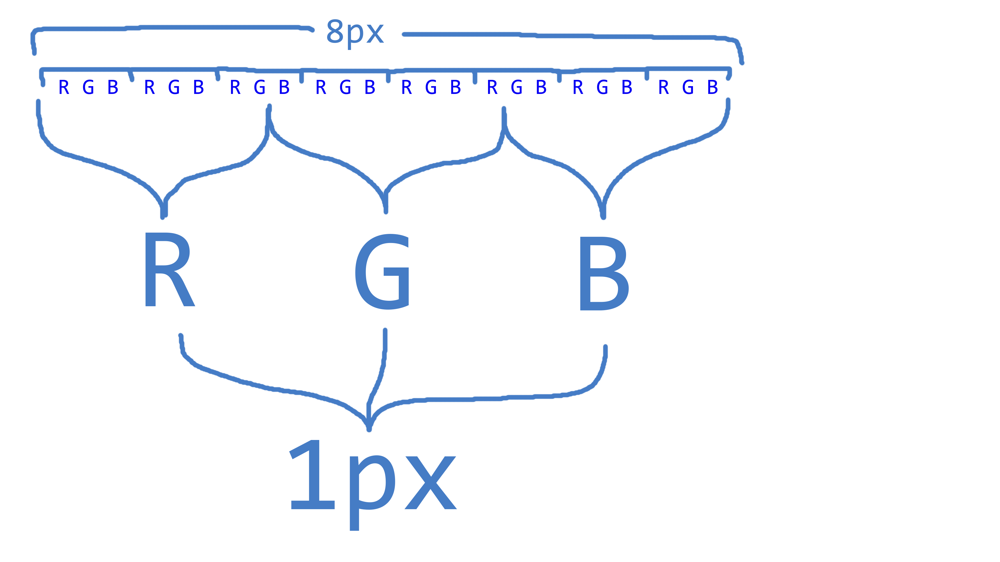

# Watermarking-Rust

## Fonctionnement

Le programme permet de cacher une image dans une autre sans que cela se voit. Le problème est que l'image à cacher doit être 8 fois plus petite que l'image qui va cacher

